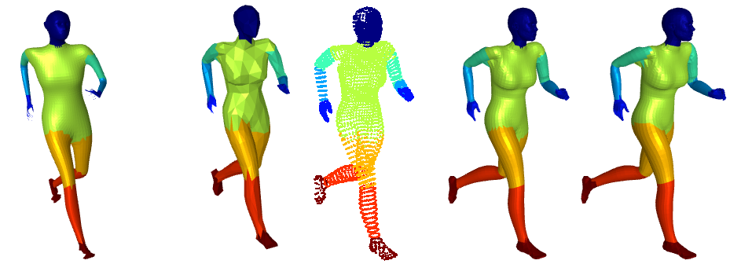

# DiffusionNet : Geometric Data Analysis (MVA)

  

*Contributors* : 
- Géraud Ilinca (Télécom Paris)
- Hadrien Levéchin (Talacom Paris)
- Louis Martinez (Télécom Paris)

In this project, we propose an in-depth exploration of some of the key results and theoretical elements of the paper ["DiffusionNet: Discretization Agnostic Learning on Surfaces"](https://arxiv.org/abs/2012.00888), by 
- [Nicholas Sharp](https://nmwsharp.com/)
- Souhaib Attaiki
- [Keenan Crane](http://keenan.is/here)
- [Maks Ovsjanikov](http://www.lix.polytechnique.fr/~maks/)

This work was carried out as part of the [Geometric Data Analysis](https://www.master-mva.com/cours/geometric-data-analysis/) course taught by [Jean Feydy](https://www.jeanfeydy.com/Teaching/index.html) (MVA M2 program). 

## Contributions

Our contributions focus on three main axes:
1. We propose a formal and complete description of the core theoretical concepts of the papers: heat diffusion on surfaces, the statement that radially symmetric filters can be obtained with a combination of diffusion and vertex-wise MLP, and spatial gradient features to go beyond radially symmetric filters. This part is fully developed in our [report](./report.pdf).
2. To evaluate the claimed expressivity of the representations learned by the model, we pre-trained a DiffusionNet model on a large 3D point-clouds dataset (ShapeNet) for a classification task. Then we fine-tuned this model on a smaller dataset for the same task, keeping the frist layers' parameters frozen. However, the results were far from convincing, illustrating that, given the experimental framework, the model has poor transfer capabilities. *Given that experiments were carried out on a quite narrow range of hyperparameters, we definitely can't conclude that the issue comes from the architecture itself*. The code for these experiments can be found under `experiments/classification_shapenet`.
3. For sake of reproductibility, we provide a [notebook](./figures.ipynb) allowing to geenrate every figure which can be found on the report or the [slides](./slides.pdf) used for our oral defense.  
*Note: To display plot the filters learned by the model, we had to retrain the model on the human segmentation dataset witohut spatial gradient features. The final checkpoint can be found under `experiments/human_segmentation_original/pretrained_models/human_seg_xyz_grad0_4x128.pth`*.
